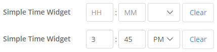

## SimpleTimeWidget
Simple entry for time portion of date/time objects.

## Features
  
This widget's purpose is to provide a time input that is both easy and fast to use. 
Provides an input for the time portion only of a date/time Mendix attribute. 
Can be used alone, or paired with a calendar-style date picker. 

## Usage
Property descriptions:  
* Show label
  * Enables default Mendix label behavior  
* Label caption
  * Custom text for the label  
* Date/time attribute (required)  
  * The attribute for this widget
* Editable
  * (Default) Access is determined by security/parent entity settings
  * (Never) Widget is never editable  
* Read-only style
  * Controls how the widget displays when not editable  
* Input style
  * Select between the standard text and special number input boxes.
    On mobile devices, number style inputs will bring up the number keyboard.  
* Invalid time message
  * An error message to display when the time cannot be parsed. 
    This message does NOT prevent saving, executing microflows, etc. 
    While this message is present, the attribute will be the last valid value.  
* Required
  * When yes, causes Mendix validation to fail when the date attribute is empty.  
* Required message
  * The error message to show when the required validation fails.  
* OnChange action
  * Enables Mendix on change behavior. Will trigger when a new, valid value is input.  

Notes on empty value:  
When all 3 inputs are cleared, the whole date/time attribute will be set to empty. 
If a new time is set before the object is committed, the last known date will be used. 
This is different from the time-only Mendix input, which permanently clears the date.  

## Demo project
[Demo project ZIP](https://github.ncsu.edu/karees/SimpleTimeWidget/blob/master/SimpleTimeWidget-Sample.zip)

## Issues, suggestions and feature requests
https://github.ncsu.edu/karees/SimpleTimeWidget/

## Development and contribution
Widget created by Kathryn Rees @ NCSU
