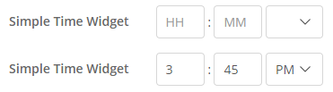

## SimpleTimeWidget
Simple entry for time portion of date/time objects.

## Features
  
This widget's purpose is to provide a time input that is both easy and fast to use. 
Provides an input for the time portion only of a date/time Mendix attribute. 
Can be used alone, or paired with a calendar-style date picker. 

## Usage
Property descriptions:  
* Show label
  * Enables default Mendix label behavior  
* Label caption
  * Custom text for the label  
* Date/time attribute (required)  
  * The attribute for this widget
* Editable
  * (Default) Access is determined by security/parent entity settings
  * (Never) Widget is never editable  
* Invalid time message
  * An error message to display when the time cannot be parsed. 
    This message does NOT prevent saving, executing microflows, etc. 
    While this message is present, the attribute will be the last valid value.  
* Required
  * When yes, causes Mendix validation to fail when the date attribute is empty.  
* Required message
  * The error message to show when the required validation fails.  
* Show clear button
  * Adds a button that will clear the inputs and set the attribute to empty.
    Warning: this will clear the date portion of the date/time attribute as well.  
* Use number inputs
  * Converts the type of the hours/minutes input boxes from text to number.
    On mobile devices, this will bring up the number instead of letter keyboard.  
* OnChange action
  * Enables Mendix on change behavior. Will trigger when a new, valid value is input.  

## Demo project
[TBA]

## Issues, suggestions and feature requests
[TBA]

## Development and contribution
Widget created by Kathryn Rees @ NCSU
